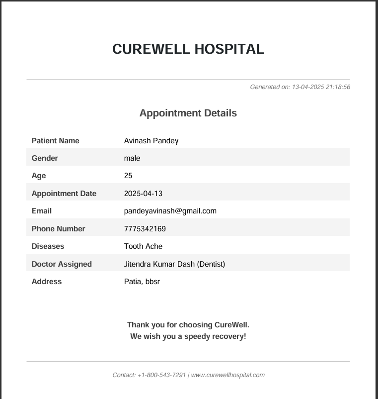

```markdown
# 🏥 CureWell Hospital Appointment Management System

A full-stack **Java-based web application** for efficient **hospital appointment booking** and **doctor management**. Built with **JSP, Servlets, JDBC, and MySQL**, this system enables patients to book appointments, manage profiles, download professional **PDF slips**, while allowing admins and doctors to manage their workflows with ease.

---

## 🚀 Features

### 👥 **User Module**
- ✅ User-friendly **Appointment Booking**
- 🧑‍⚕️ **Doctor Selection** with specialization filter  
- 📄 Auto-generated **PDF Appointment Slips**  
- 📆 View and manage appointments  
- 🔐 Secure password change  

### 👨‍⚕️ **Doctor Module**
- 🔐 Doctor login  
- 🏠 Personalized dashboard  
- 📝 Manage profile  

### 👨‍💼 **Admin Module**
- 🔐 Admin login  
- 🧾 Manage doctors  
- 📋 View all appointments  
- 📊 Dashboard summary  

---

## 🧱 Architecture & Design Patterns

- 🧭 **MVC Pattern** – Separation of business logic, presentation & routing  
- 📦 **DAO Pattern** – Clean, modular DB operations  
- 🔐 **Session Management** – Role-based authentication for secure access  

```text
Frontend (JSP) ➝ Servlets ➝ DAO ➝ MySQL
```

---

## 🛠️ Tech Stack

- 🌐 **Frontend**: JSP, HTML5, CSS3, Bootstrap 5  
- ⚙️ **Backend**: Java Servlets (MVC)  
- 🗄️ **Database**: MySQL  
- 🧾 **PDF Generation**: iText  
- 🧩 **Server**: Apache Tomcat 9  
- 🧠 **IDE**: Eclipse / IntelliJ IDEA  

---

## 📁 Project Structure

```bash
HospitalManagementSystem/
│
├── src/
│   ├── main/
│   │   ├── java/com/
│   │   │   ├── admin.servlet/       → Admin Controllers
│   │   │   ├── user.servlet/        → User Controllers
│   │   │   ├── doctor.servlet/      → Doctor Controllers
│   │   │   ├── dao/                 → DAO Layer
│   │   │   ├── db/                  → DB Utility (DBConnect.java)
│   │   │   └── entity/              → POJO Classes (Doctor, User, etc.)
│   │   └── webapp/
│   │       ├── admin/               → Admin JSP Pages
│   │       ├── doctor/              → Doctor JSP Pages
│   │       ├── component/           → Reusable UI Fragments (Navbar, Footer)
│   │       └── *.jsp                → Core Pages (Login, Appointment, etc.)
│
├── screenshots/                     → Project screenshots
├── pom.xml                          → Maven dependencies
└── README.md
```

---

## 📸 Screenshots

### 🏠 **Home Pages**
- 🧑‍💻 Index Page  
    
  

- 🔐 Admin Login  
  

- 🔐 Doctor Login  
  

- 🔐 User Login  
  

---

### 👤 **User Module**
- 🏠 User Home  
  

- 📝 Book Your Appointment  
  

- 📋 Your Appointments  
  

- 🔒 Change Password  
  

- 📄 Appointment Slip (PDF)  
  

---

### 🧑‍⚕️ **Doctor Module**
- 🏠 Doctor Home  
  

- 📝 Manage Profile  
  

---

### 🛡️ **Admin Module**
- 📊 Admin Dashboard  
  

- 📄 Doctor Details  
  

- 📋 Patient Details  
  

---

## ⚙️ Setup & Installation

1️⃣ **Clone the repository**  
```bash
git clone https://github.com/yourusername/CureWell-Hospital-Management.git
```

2️⃣ **Import into IDE** (Eclipse or IntelliJ IDEA) as a **Maven Project**

3️⃣ **Create MySQL Database**  
```sql
CREATE DATABASE hospital;
```

4️⃣ **Configure Database in `DBConnect.java`**  
```java
String url = "jdbc:mysql://localhost:3306/hospital";
String user = "root";
String password = "yourpassword";
```

5️⃣ **Deploy on Apache Tomcat 9**

6️⃣ **Access the app**  
```
http://localhost:8080/HospitalManagementSystem/
```

---

## 📄 PDF Appointment Slip

- 📌 Auto-generated after booking  
- 👨‍⚕️ Contains patient, doctor, and visit details  
- ✨ Designed using **iText** for a professional look  

---

## 🎯 Future Enhancements

- 📧 Email/SMS confirmations  
- 🔒 Spring Security integration  
- 📱 Mobile-responsive UI  

---

## 📜 License

Licensed under the **MIT License**.  
See the [LICENSE](./LICENSE) file for details.

---

## 🤝 Contributing

Fork, improve, and contribute!  
Open an **issue** or submit a **pull request** — every bit helps.

🔗 **Connect with me on LinkedIn**  
[Rakesh Kumar Parida](https://www.linkedin.com/in/rakesh-kumar-parida-523b55308/)

⭐ **If you like this project, give it a star!**
```
