```markdown
# 🏥 CureWell Hospital Appointment Management System

A full-stack **Java-based web application** designed for efficient **hospital appointment booking** and **doctor management**. Built with **JSP, Servlets, JDBC, and MySQL**, this project allows users to book appointments, manage profiles, download sleek **PDF appointment slips**, and enables admins to manage doctors and appointments seamlessly.

---

## 🚀 Features

### ✅ **User Module**
✔️ User-friendly **Appointment Booking**  
✔️ **Doctor Selection** with specialization filtering  
✔️ Auto-generated **PDF Appointment Slips**  
✔️ View & track personal appointments  
✔️ Change password securely  

### ✅ **Doctor Module**
✔️ Secure Doctor Login  
✔️ Access doctor dashboard  
✔️ View and manage profile details  

### ✅ **Admin Module**
✔️ Secure Admin Login  
✔️ Add & manage doctors  
✔️ View all appointments  
✔️ Dashboard summary view  

---

## 🧱 Architecture & Design Patterns

- **🧭 MVC Pattern** – Structured separation of business logic, presentation, and routing  
- **📦 DAO Pattern** – Modular and reusable DB operations (e.g., `DoctorDao`, `UserDao`)  
- **📄 PDF Generation** – Generated using `iText` for elegant appointment slips  
- **🔐 Session Management** – Controlled access for Admin, Doctor, and User roles  

```text
Frontend (JSP) → Servlet Controllers → DAO Layer → MySQL DB
```

---

## 🛠️ Tech Stack

🔹 **Frontend**: JSP, HTML5, CSS3, Bootstrap 5  
🔹 **Backend**: Java Servlets (MVC)  
🔹 **Database**: MySQL  
🔹 **PDF Library**: iText  
🔹 **Server**: Apache Tomcat 9  
🔹 **IDE**: Eclipse IDE

---

## 📁 Project Structure

```
HospitalManagementSystem/
│
├── src/
│   ├── main/
│   │   ├── java/com/
│   │   │   ├── admin.servlet/       → Admin Controllers
│   │   │   ├── user.servlet/        → User Controllers
│   │   │   ├── doctor.servlet/      → Doctor Controllers
│   │   │   ├── dao/                 → DAO Layer
│   │   │   ├── db/                  → DB Utility (DBConnect.java)
│   │   │   └── entity/              → POJO Classes (Doctor, User, etc.)
│   │   └── webapp/
│   │       ├── admin/               → Admin JSP Pages
│   │       ├── doctor/              → Doctor JSP Pages
│   │       ├── component/           → Reusable UI Fragments (Navbar, Footer)
│   │       └── *.jsp                → Core Pages (Login, Appointment, etc.)
│
├── screenshots/                     → Project screenshots
├── pom.xml                          → Maven dependencies
└── README.md
```

---

## 📸 Screenshots

### 🏠 **Home Pages**
- **Index Page**
  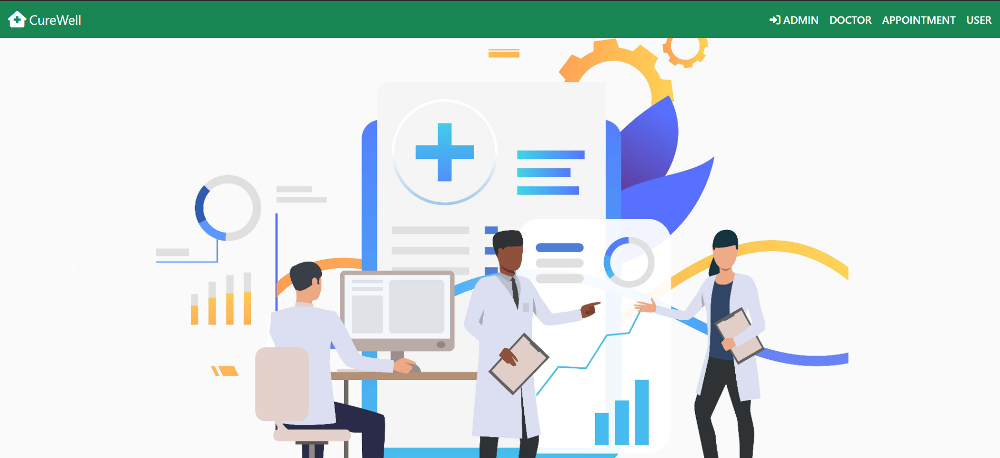
  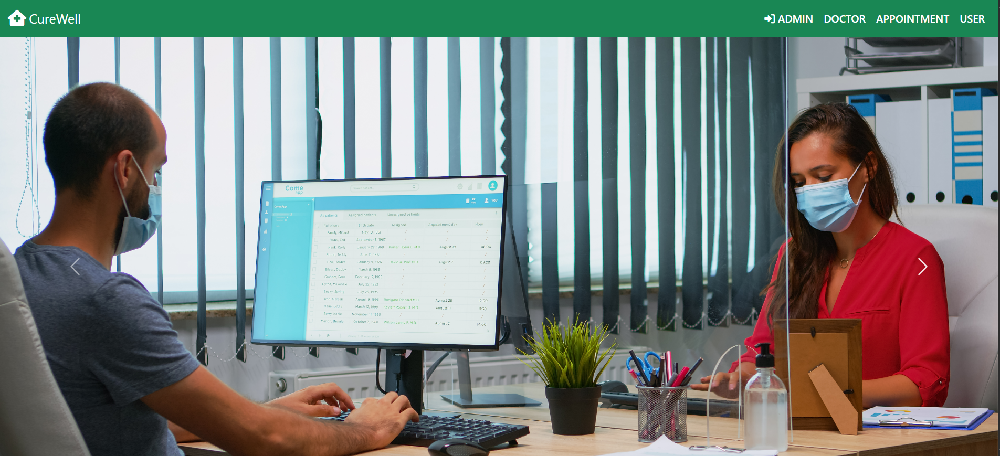

- **Admin Login**
  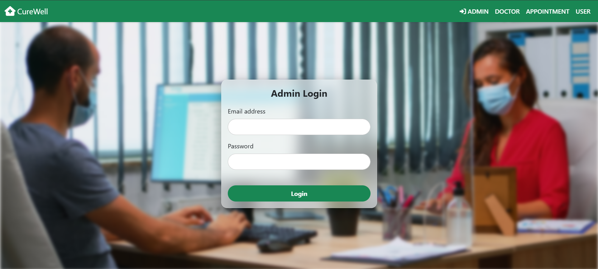

- **Doctor Login**
  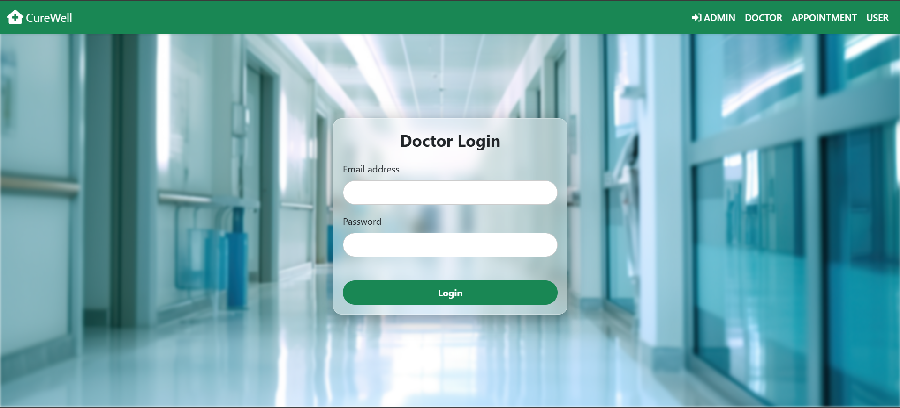

- **User Login**
  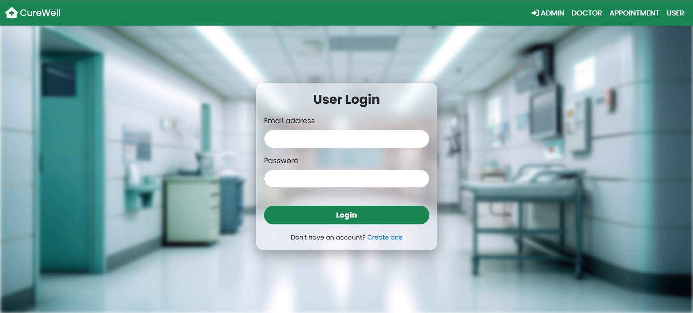

---

### 👤 **User Module**
- **User Home**
  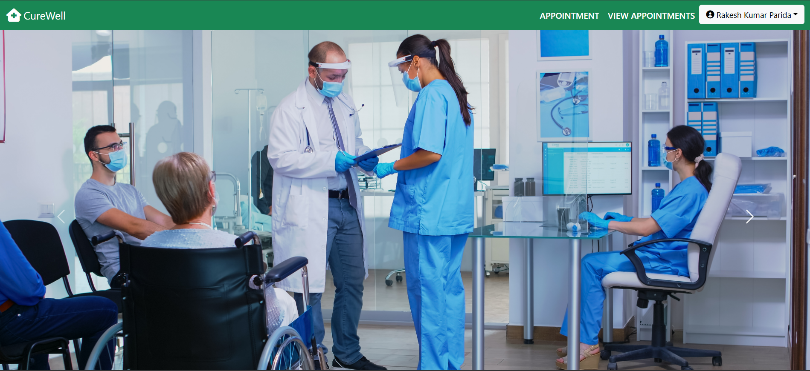

- **Book Your Appointment**
  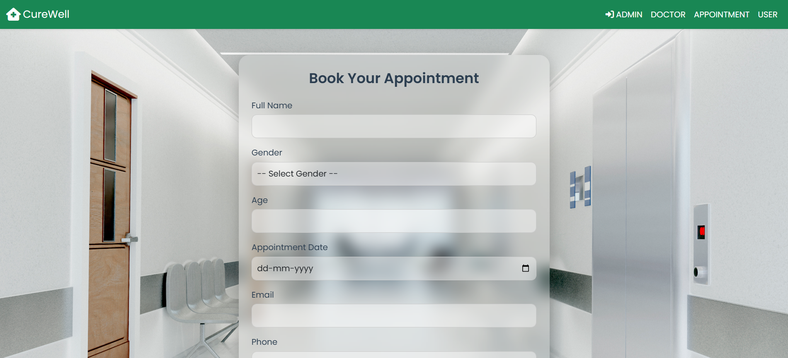

- **Your Appointments**
  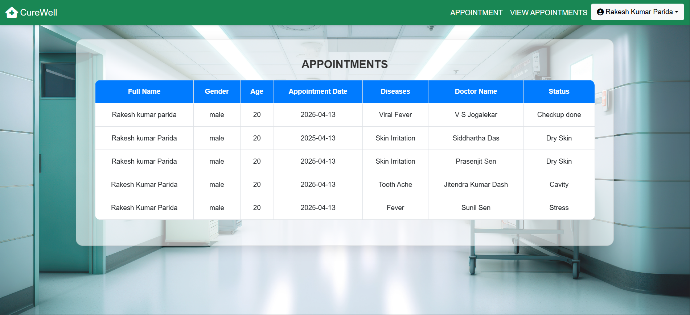

- **Change Password**
  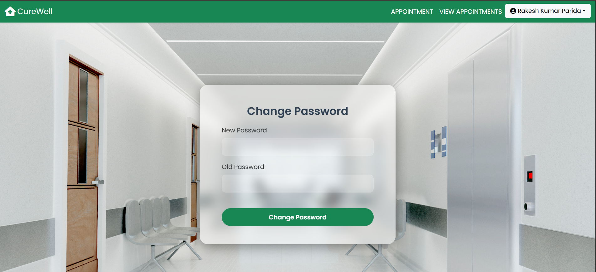

- **Generated Appointment Slip (PDF)**
    

---

### 🧑‍⚕️ **Doctor Module**
- **Doctor Home**
  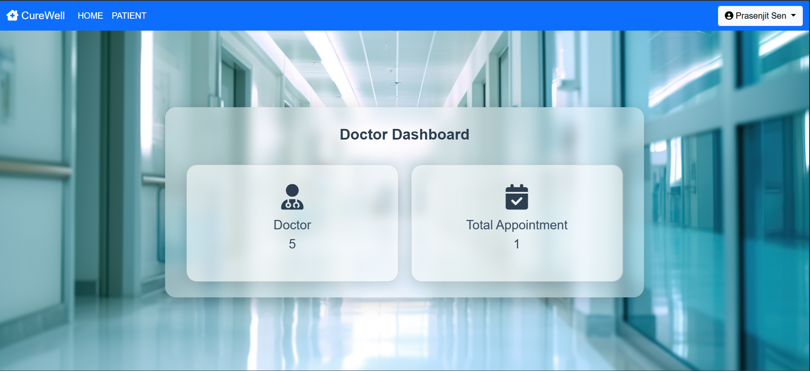

- **Manage Doctor Profile**
  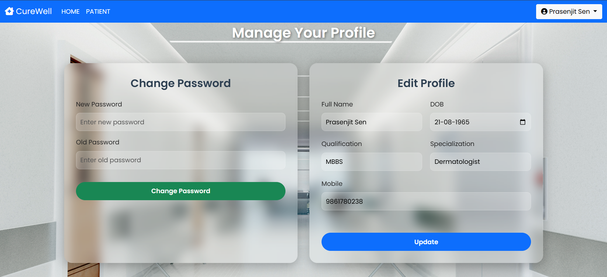

---

### 🛡️ **Admin Module**
- **Admin Dashboard**
  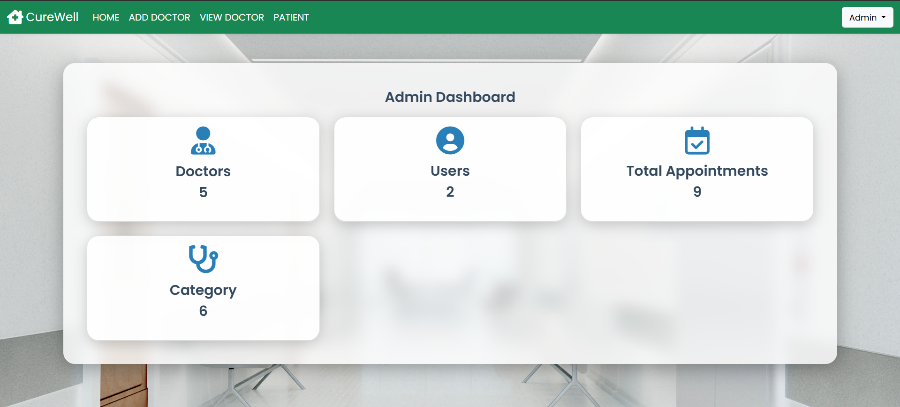

- **Doctor Details**
  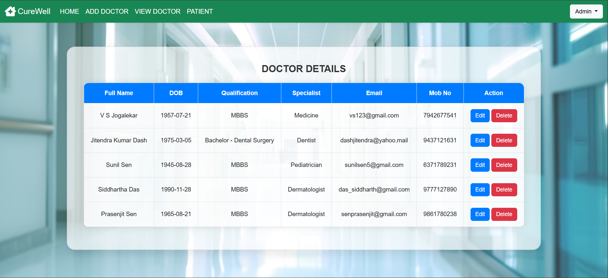

- **Patient Details**
  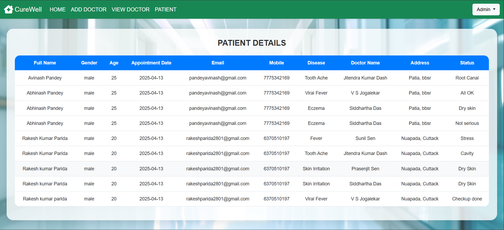

---

## ⚙️ Setup & Installation

1️⃣ Clone the repository  
```bash
git clone https://github.com/yourusername/CureWell-Hospital-Management.git
```

2️⃣ Import into **Eclipse/IntelliJ IDEA** as a Maven Project  

3️⃣ Create the **MySQL Database**  
```sql
CREATE DATABASE hospital;
```

4️⃣ Configure Database in `DBConnect.java`  
```java
String url = "jdbc:mysql://localhost:3306/hospital";
String user = "root";
String password = "yourpassword";
```

5️⃣ Deploy on **Apache Tomcat 9**  

6️⃣ Access the app  
```
http://localhost:8080/HospitalManagementSystem/
```

---

## 🔐 PDF Appointment Slip

- Auto-generated after successful booking  
- Includes all patient details, doctor name & specialization, and visit date  
- Professionally styled using **iText**

---

## 🎯 Future Enhancements

- ✨ Role-based dashboards (Doctor/User/Admin segregation)
- 📧 Email & SMS confirmation on appointment
- 🔒 Spring Security integration
- 📱 Mobile-responsive UI

---

## 📜 License

This project is licensed under the **MIT License**. See the [LICENSE](./LICENSE) file for details.

---

## 🤝 Contributing

Feel free to fork, improve, and contribute!  
Open an **issue** or submit a **pull request** – every bit helps.

🔗 **Connect with me on LinkedIn**  
[Rakesh Kumar Parida](https://www.linkedin.com/in/rakesh-kumar-parida-523b55308/)

⭐ **If you like this project, please give it a star!**
```
